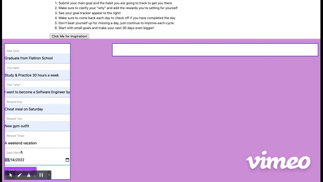
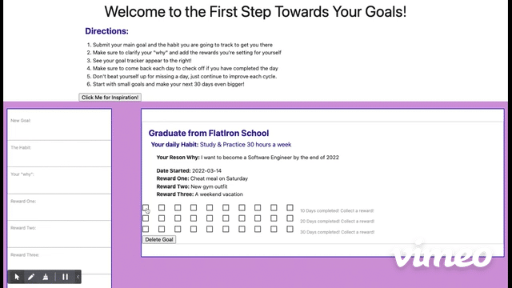
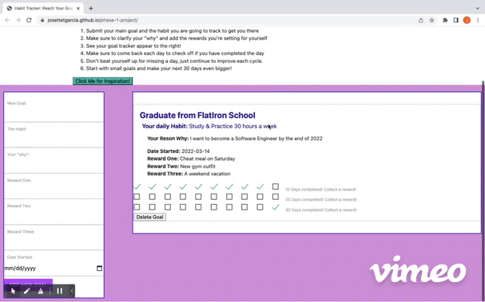
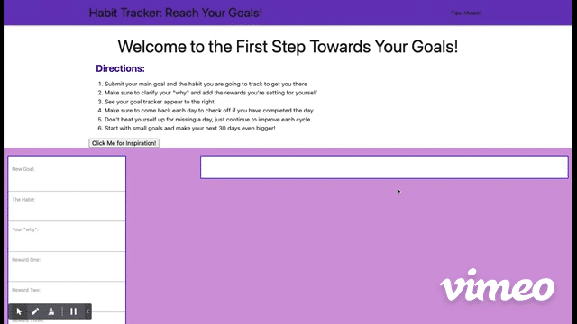
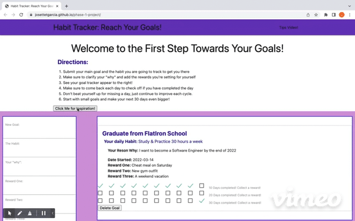

## The Habit Tracker App

>The first step to reaching your goals; one habit, one day, one reward at a time!

## App Philosophy

This app is inspired by Atomic Habits by [James Clear](https://jamesclear.com/). Clear's philosphy, as well as this app's, is to break down goals into smaller daily habits that when completed consistently, can allow individuals to reach larger accomplishments. 

There are many tools that follow a "habit tracking" theory; tracking journals, calendars, and the fancier apps. This app makes it simple and starts with just 30 days and the three rerwards the user promises themself. Tracking your goals should be the least hardest thing about reaching them.

## Features
- Can submit their goals using the Goal Creation Form
    - Add your goal title 
    - Add your "why"
    - Set your rewards
- App creates a Goal Card for the user and renders 30 checkboxes for 30 days of habit tracking
- Ability to delete a goal when it no longer meets your needs
- Can receive a random quoute from [James Clear Quotes API](https://quoteclear.web.app/) 
- Navigate to the `Tips Video!` page to watch a summary of James Clear's Atomic Habits to motivate your progress

## How to Use

1. Use the left, side Form to enter the following information about your goal
  - `New Goal` Title: What is your larger goal?
  - `Habit`: What is the habit you will track daily that would help you reach your goal?
  - `Reward 1-3`: Enter rewards that you can provide yourself when you've reached 10 daily habit checks
  - `Date Started`: Enter the date you started tracking this habit
2. Click the `Add New Goal` button when you have completed these fields and watch your new Goal Card render to the right
  > 
3. Check off the daily boxes until you have reached 30 days.
> 
4. Click the `Delete Goal` button when you no longer want to track your goal
> 
5. Vist the `Video Tips!` page to watch the added youtube video
> 
6. Click the `Click Me for Motivation` button to receive a pop up with a random 
quote from James Clear
> 

## Technologies Used

This web app was made using:
- [Materialize](https://materializecss.com/) ( a CSS Framework)
- HTML
- Javascript 
-[James Clear Quotes API](https://quoteclear.web.app/) 
- Local JSON server

**Note**: This app is an SPA (single page application)

